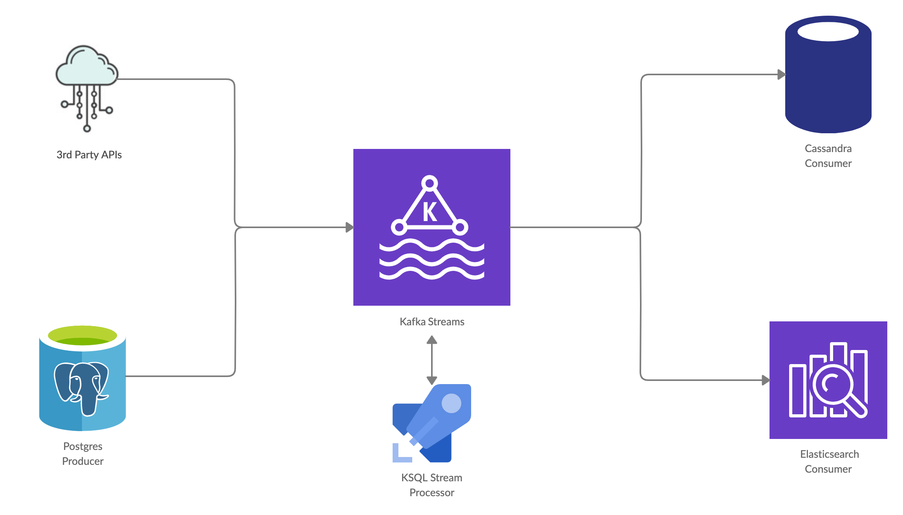

---

### Share your use-case: [Google Form](https://forms.gle/GGg2hvnEpG6r4bgg7)

Will help in shaping initial features.

---

Read more about it on my Blog at Towards Data Science: https://tinyurl.com/yyqr79dh

# Oesophagus Ecosystem

Oesophagus enables you to deploy an entirely plug-n-play **Data Infrastructure** to advance your organisation's data capability.

The architecture consists of:

- **Data Producers**, services to fetch data from Relational Databases, 3rd Party APIs, etc.
- **Stream Processors**, like Kafka Streams and KSQL.
- **Data Consumers**, services to load data into Columnar or Document-Oriented Databases, Search Indices, or other downstream databases and services.



# Example: Postgres to Elasticsearch Real-Time ETL Setup:

## Requirements

- Install [docker](https://docs.docker.com/install/)
- Install [docker-compose](https://docs.docker.com/compose/install/)

## Deployment

```sh
# Start kafka, connect, schema-registry, ksqldb, ksqlcli, postgres, elasticsearch and automation-scripts
$ docker-compose up -d
```

## Testing Services

```sh
# GET Request on Elasticsearch server to test availability
$ curl -f 'localhost:9200'

# Search all indices in Elasticsearch
$ curl -f 'localhost:9200/_search'
```

## Why use Oesophagus's Postgres CDC?

Oesophagus Postges CDC Producer is built to **Extract, Transform and Load** Relation Databases' data to Downstream databases/services.

It uses **Change-Data-Capture** Pattern to read changes from the **WAL** (Write-Ahead-Logs) of the source database.

> **Change Data Capture (CDC)**, as its name suggests, is a **Database Design Pattern** that captures individual data changes instead of dealing with the entire data. Instead of dumping your entire database, using CDC, you would capture just the data changes made to the master database and apply them to the BI databases to keep both of your databases in **sync.** This is much more **scalable** because it only deals with data changes. Also, the replication can be done much faster, often in **near real-time.**

_Information Source: FlyData_

### Functionality

Note: Before starting the service, `wal2json` plugin should be installed on your postgres container to fetch database logs.

1. As the service starts, it will first make a **Full Table Replication** for all the listed table name keys in `producer.json`.
2. After the full table migration, the service starts listening to **database logs** using the **replication slot** that is created automatically before **Full Table Migration** starts.
